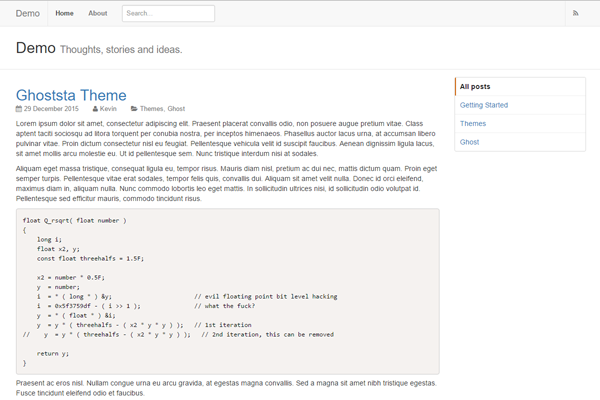

ghoststa
======

Responsive, minimalistic, clean and content-oriented theme, inspired by GitHub. [This time](https://github.com/nehalist/gitsta) for Ghost.

- [Demo](http://ghoststa.nehalist.io)



### Features
- Responsive
- Code highlighting
- Placeholder for Disqus comments _(see FAQ)_
- Tag / recent posts / authors list
- Post search (by [GhostHunter](https://github.com/jamalneufeld/ghostHunter))

### Download
Either clone and build it yourself or download it at [GitHub Releases](https://github.com/nehalist/ghoststa/releases).

### Requirements
It's recommended to _enable_ the [Public API](https://blog.ghost.org/public-api-labs/) in your backend, due to the usage of the `{{get}}`-helper to list tags and recent posts. As soon as the Ghost development team enables the public API by default (aka "when it's not beta anymore") this will be obsolet.

### FAQ
- *How to add [Disqus](https://disqus.com/) comments?*

Since the `disqus_thread` container already exists all you need to do is to paste the universal code from disqus into your blog footer in the backend.

__Important:__ Pasting the code into your blog footer means that Disqus is loaded on every page. Since the `disqus_thread` container doesn't exist on every page this can cause problems. To avoid these problems just wrap the code in an if-statement to check if the container exists

```
<script>
if($("#disqus_thread").length) {
  // your disqus universal code
}
<script>
```

- *How to add code highlighting?*

Code Highlighting is enabled by default and powered by [Prism](http://prismjs.com/).

- *How does the search engine work?*

See [GhostHunter](https://github.com/jamalneufeld/ghostHunter).

### Development & Building
To develop or build the theme you'll need:

- Bower
- Grunt
- SASS

To start developing install npm dependencies with `npm install` and start the default task, `grunt`.

Building is done by Grunt with `grunt build`. This task validates all scss and js files, creates and concatenates vendor files and copies bower files to its destination. Files generated by this build process are:

- `assets/css/style.css` (compiled SASS)
- `assets/vendor/vendor.js` (concatenated vendor JS)
- `assets/vendor/vendor.css` (concatenated vendor CSS)
- `assets/fonts/*` (font awesome icons)

Other tasks available are:

- `grunt validate`: Validates all (scss and js) files
- `grunt clean`: Cleans vendor files
- `grunt zip`: Creates a zip file of the theme

During development the default task, `grunt`, will take care of most of your needs:

- Reload theme on changes (with [BrowserSync](https://www.browsersync.io/))
- Compile SASS
- Install bower dependencies (and re-build the vendor files)

The default task will also run the `build` task in case the autogenerated files are missing.

### Credits
* [Bootstrap](http://www.getbootstrap.com)
* [GitHub](http://www.github.com)
* [Font Awesome](http://fortawesome.github.io/Font-Awesome/)
* [PrimerCSS](http://primercss.io/)
* [Grunt](http://gruntjs.com/)
* [Bower](http://bower.io/)
* [BrowserSync](https://www.browsersync.io/)
* [GhostHunter](https://github.com/jamalneufeld/ghostHunter)
* [Prism](http://prismjs.com/)

And [@acburdine](https://twitter.com/acburdine/) for testing!
